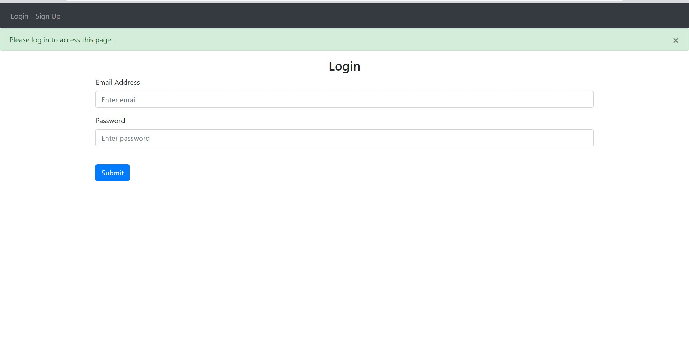
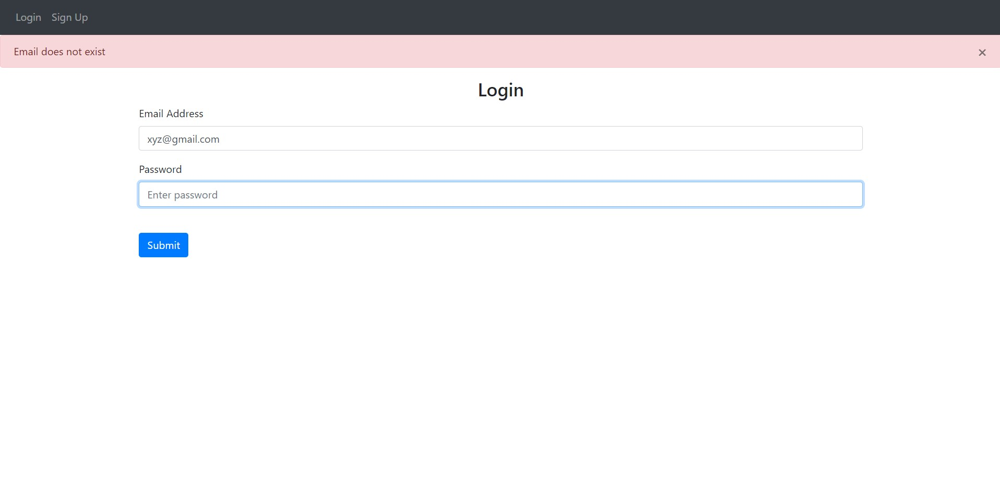
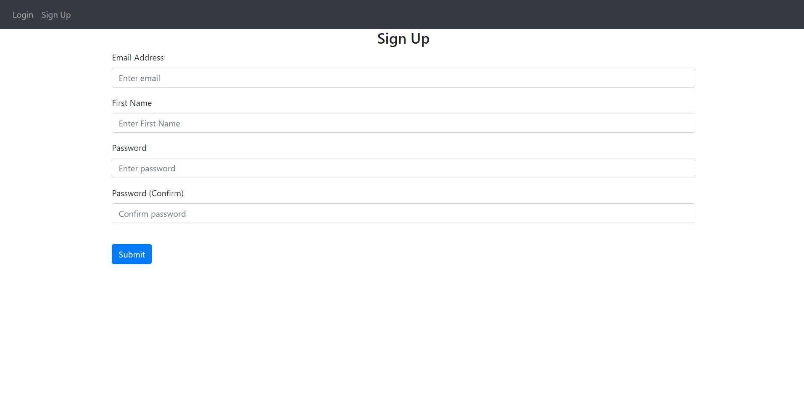
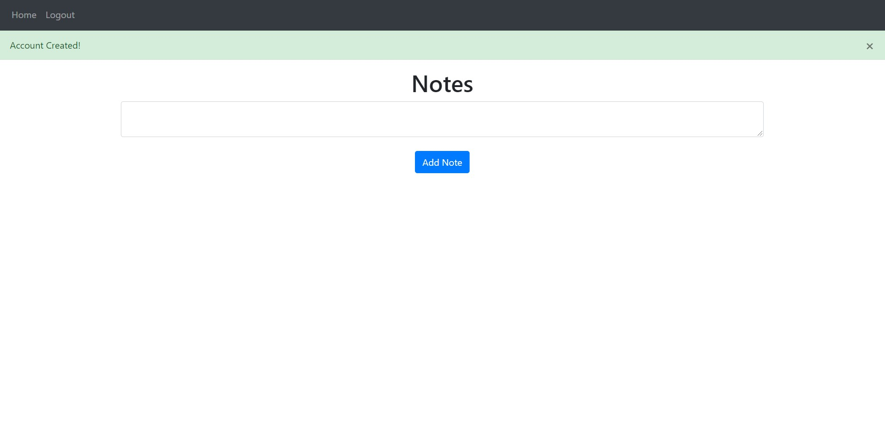
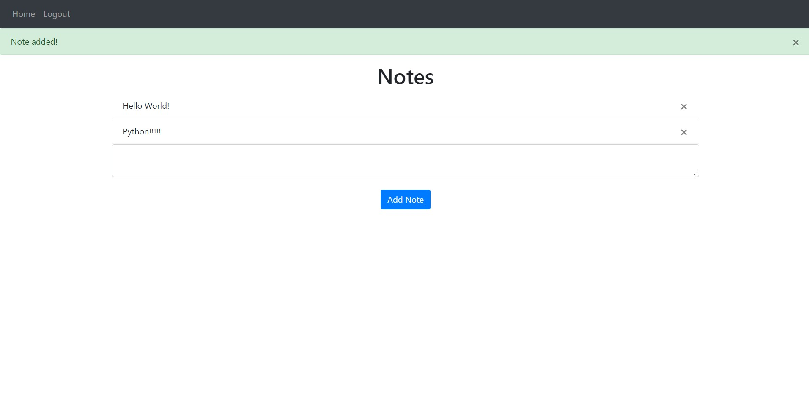
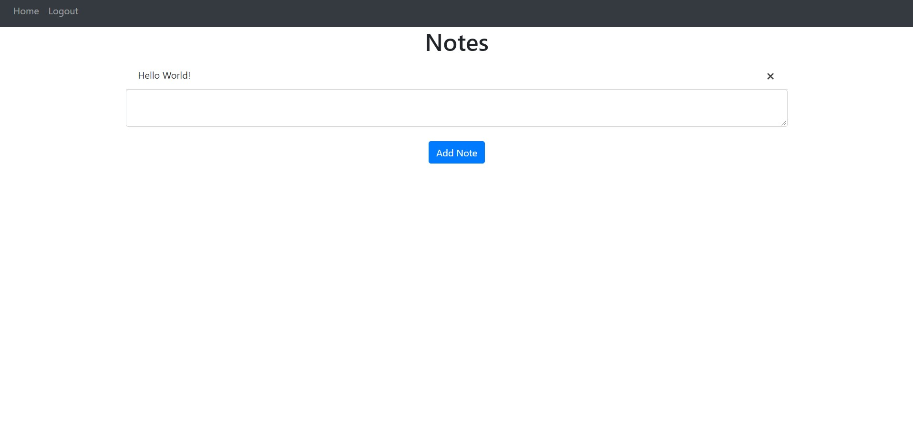

> NOTE APP

This is a note taking app, which has user authentication feature provided Flask Web frame-work.

<h4>This is a login page</h4>

<h4>Checks if email exists</h4>

<h4>Sign up page</h4>

<h4>Home page</h4>
After the user authenticiated, the user can now create notes

<h4>Add Note</h4>
After writing note in text box, the user can click on Add Note to add it into database

<h4>Delete note</h4>
The user can click on 'X' button to delete note from database.
---------